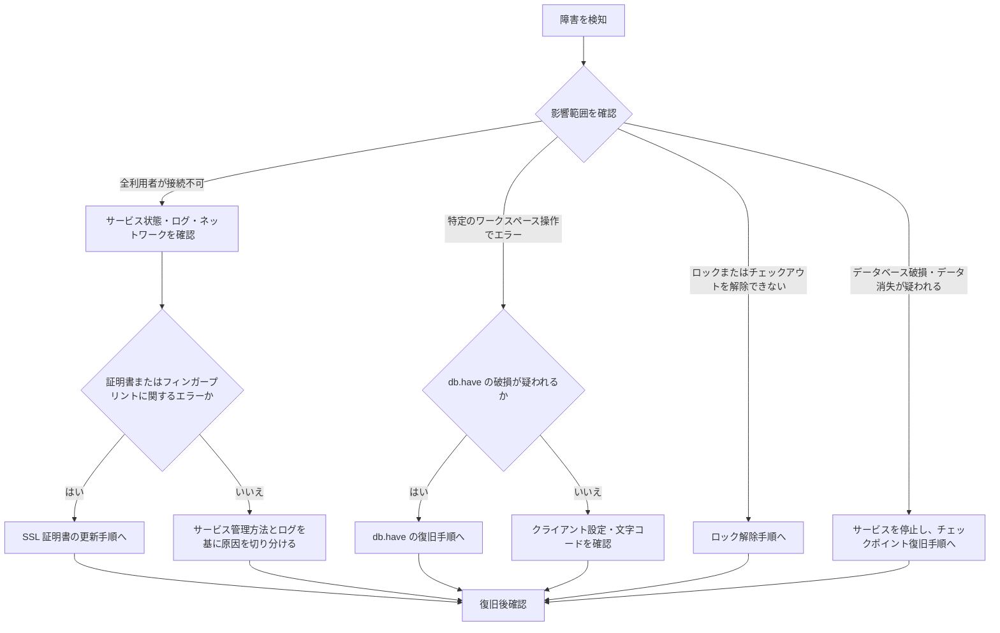

# Helix Core 障害対応の判断フロー

Helix Core (p4d) で障害が起きたときの初動と、個別手順へ進むための判断フローです。
この文書は復旧コマンドの実行手順ではありません。データベースやアーカイブに変更を加える前に、必ず対象サーバー、`P4ROOT`、影響範囲を確認してください。

## 最初に行うこと

1. 影響を確認する。全利用者か、特定のワークスペースまたはファイルだけかを切り分ける。
2. 発生時刻、利用者が行っていた操作、エラーメッセージ、接続先の `P4PORT` を記録する。
3. p4d のサービス状態とログを確認する。サービスが稼働している場合は `p4 info` を実行して結果を保存する。
4. `P4ROOT`、p4d のバージョン、直近のチェックポイントとジャーナルの保管場所を確認する。

原因が確定するまで、`P4ROOT` 内のデータベースを削除・上書きしないでください。停止や復旧を行う場合は、関係者へ影響範囲と作業開始を連絡します。

## 判断フロー

## 症状別の対応先

### 全利用者が接続できない

まず p4d のサービス状態、サーバーログ、名前解決、ネットワーク、`P4PORT` を確認します。`p4 info` が失敗する場合、クライアント側の作業を始める前にサーバー側の稼働状況を確認してください。

証明書期限切れ、証明書再作成後、またはフィンガープリント不一致が原因なら、[SSL 証明書の更新]({{ '/1-perforce/260-ssl-certificate-renewal/' | relative_url }}) に進みます。更新後は P4V、CLI、CI、Proxy、Swarm の trust 更新と疎通確認が必要です。

### 特定のワークスペースで操作できない

`db.have` に関するエラー、またはベンダーから `db.have` の破損を指摘された場合は、[db.have の復旧]({{ '/1-perforce/810-db-have-recovery/' | relative_url }}) に進みます。

この復旧では対象ワークスペースが取得済みと認識するリビジョン情報を再構築するため、復旧後に対象ワークスペースで Sync を実行します。

文字コード変換のエラーが出る場合は、[同期時のエラー]({{ '/1-perforce/910-troubleshoot-sync-encoding-error/' | relative_url }}) と [P4V の設定・操作]({{ '/1-perforce/010-configure-p4v/' | relative_url }}) を確認します。サーバーの文字コード設定とクライアントの設定を管理者に確認してから変更してください。

### チェックアウトまたはロックを解除できない

まず `p4 opened -a` で、対象ファイル、ワークスペース、利用者を確認します。利用者と作業状況を確認したうえで、[他ユーザーのチェックアウトを解除する]({{ '/1-perforce/820-revoke-other-user-checkout/' | relative_url }}) に進みます。

`revert -C` や `unlock -xf` は他者の作業内容に影響します。対象パスを最小化し、実行者・対象・理由を記録します。

### データベース破損またはデータ消失が疑われる

複数のワークスペースで障害が起きる、p4d が起動しない、またはデータベース破損が疑われる場合は、自己判断で `db.*` を削除しません。

サービスを停止して現行の `P4ROOT` を退避し、利用するチェックポイントとジャーナルを確定してから、[チェックポイントと復旧]({{ '/1-perforce/250-checkpoint-backup-and-restore/' | relative_url }}) に進みます。復旧判断はバックアップの取得状況と復旧目標時点を確認できる管理者が行います。

## 復旧後の確認

作業を終える前に、少なくとも次を確認します。

* `p4 info` で対象サーバーが応答する。
* 代表的なワークスペースで Sync と必要な操作ができる。
* 監視、CI、Swarm、Proxy など接続先サービスが復旧している。
* 実施した操作、影響範囲、復旧時刻、残課題を記録し、関係者へ共有した。

## 関連資料

* [Helix Core 管理者向け手順]({{ '/1-perforce/200-administrator-guide/' | relative_url }})
* [Helix Core Server Administrator Guide](https://www.perforce.com/perforce/doc.current/manuals/p4sag/Content/P4SAG/Home-p4sag.html)